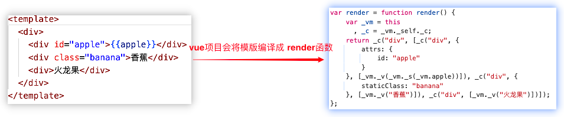

🔥Vue2虚拟节点以及createElement函数

# 1. 概念介绍

虚拟 DOM (Virtual DOM，简称 VDOM) 是一种编程概念。

意为将目标所需的 UI 通过数据结构“虚拟”地表示出来。一般保存在内存中，将真实的DOM与之保持同步。 

具体来说，虚拟 DOM 是由一系列的 ```JavaScript 对象```组成的树状结构，每个对象代表着一个DOM元素，包括元素的标签名、属性、子节点等信息。

虚拟 DOM 中的每个节点都是一个 ```JavaScript 对象```。

> vue是基于 vdom 的前端框架，组件渲染时```执行 vue实例上的 render方法 会返回 vdom```，渲染器再把 vdom 通过浏览器增删改的 api 同步到 dom。

如下这种DOM结构。

```js 
<div>
    <div id="apple">苹果</div>
    <div class="banana">香蕉</div>
    <div>火龙果</div>
</div> 
```

上面这种DOM结构在vue中会编译成对应结构的```createElement```函数调用。

最终会生成类似下面这种vdom结构（省略部分属性）。

```js
{
  tag:'div',
  data:undefined,
  children:[
    {
      tag:'div',
      data:{
        attrs:{
          id:"apple"
        }
      },
      children:[
        {
          tag:undefined,
          text:"苹果"
        }
      ]
    },
    {
      tag:'div',
      data:{
        staticClass:'bannana'
      },
      children:[
        {
          tag:undefined,
          text:"香蕉"
        }
      ]
    },
    {
      tag:'div',
      data:undefined,
      children:[
        {
          tag:undefined,
          text:"火龙果"
        }
      ]
    }
  ]
}
```

```在前端领域虚拟 DOM 就是一个普通的 JS对象```。

我们可以利用对象上的属性来构建```真实 DOM 树```。

# 2. vue 的模板编译

在 vue 中，通常我们会采取Runtime-Only模式运行 vue 项目。

在这个模式中，我们在构建阶段所有的模版```(<template>标签中的HTML)```已经被```预编译```成Javascript渲染函数（render函数）。

预编译过程通常由如vue-loader配合vue-template-compiler这样的工具在Webpack构建过程中完成，它们会把.vue文件中的模板转换为高效的JavaScript代码。

如下图，会将模版部分编译成一个 render 函数。 

 

```不管是使用template属性直接编写HTML模板还是使用 vue 脚手架搭建项目，模版最终都会编译为 render 函数```。

# 3. render 函数的本质

## 3.1 _render 方法

在 vue 源码中，是调用 vm._render 函数来获取需要渲染的vDom。

那么_render和 render函数有什么关联呢？

在 vue 框架初始化时中给Vue构造函数上添加了 _render 方法。 

```js
Vue.prototype._render = function () {
    const vm = this;
    const { render } = vm.$options;
    // 调用 vue 实例中的 render 选项 返回 vdom
    let vdom = render.call(vm);
    return vdom;
}
``` 
可以看出_render方法就是调用 vue 实例上的render方法。

所以核心还是  vm.render 方法。

## 3.2 vm是什么？

上面我们可以看到有大量的 vm 代码。

其实 vm 在 vue 中代表 ```vue实例```。

每一个 vue 组件都对应着一个 vue实例。

每一个实例上都有对应的 render 方法。比如前面 ```2.1``` 所提到的：

```js
var render = function render() {
    var _vm = this
      , _c = _vm._self._c;
    return _c("div", 
        [
            _c("div", {attrs: {id: "apple"}}, [_vm._v("苹果")]), 
            _c("div", {staticClass: "banana"}, [_vm._v("香蕉")]), 
            _c("div", [_vm._v("火龙果")])
        ]
    );
};
``` 

上面这个render函数会被挂载到```vm.render```上。

## 3.3 vm._self指的是什么？ 

vm._self 是在vue框架初始化时 vm._init 方法中设置的，如下。

```js
Vue.prototype._init = function(){
    const vm = this
    vm._self = vm
}
```  
通过上面，我们很容易发现_self就是指的实例本身。

## 3.4 vm._self._c指的是什么？

上面我们知道 vm._self 其实就是 vm 。

那么 ```vm._self._c  === vm._c```。

vm._c 是在vue框架初始化时在 initRender 函数中定义的。

```js
export function initRender(vm){
    vm._c = (a, b, c, d) => createElement(vm, a, b, c, d, false)
}
```  

可以看到实际上是调用了 createElement 这个函数。

## 3.5 总结

通过上面的总结，我们知道 render 函数本质上就是将模版对应结构的createElement函数调用。

# 4. vnode

之前我们知道render函数的返回值是一个vdom，所以createElement的返回结果也是一个vdom，即带有特殊标识的js对象。

既然这个vdom是一个比较关键的对象信息，那么vue中有没有将他抽成一个通用的类来使用呢？

答案是有的。

因为需要频繁的创建vdom，所以vue将其抽象成一个类，如下（```后面我们就把vdom叫做vnode```）。 

```js
export default class VNode {
  tag
  data
  children 
  elm
  context
  text
  constructor(
    tag,
    data,
    children, 
    text,
    elm,
    context
  ) {
    this.tag = tag
    this.data = data
    this.children = children
    this.elm = elm 
    this.context = context
    this.text = text
  }
}
```

由上面的代码可知。

vnode的构造参数是有序且固定的。

意味着创建时不能将参数顺序传错，否则会产生比较大的问题。

我们详细阐述下下面几个核心属性。

## 4.1 tag

这个参数指定了要创建的虚拟节点的标签名称。

这个参数决定了最终会渲染成什么样的 DOM元素。

tag可以是 HTML 元素，比如字符串```'span'、'div'```。

```js
// 编译前
<div></div>
// 编译后
_createElement("div") 
// _createElement函数执行后
VNode {
  tag:"div"
}
``` 

也可以是一个组件引用，同样可以是一个动态标签。 

## 4.2 data

data 参数通常是一个对象，包含了用于描述 VNode 的各种属性和配置信息。

data参数可以由以下几种构成：

1. attrs

attrs 是一个对象，包含了要设置在元素上的静态属性。

如下创建一个带有 src 属性的 img 元素。

```js
// 编译前

// 编译后
_createElement('img', { attrs: { src: 'image.jpg' } });
// _createElement函数执行后
VNode {
  tag:"img",
  data:{
    attrs: { src: 'image.jpg' }
  }
}
```

2. 类 (staicClass)

可以使用 class 属性来设置 CSS 类。

```js
// 编译前
<div class="custom-class"></div>
// 编译后
_createElement('div', { staicClass: 'custom-class' });
// _createElement函数执行后
VNode {
  tag:"img",
  data:{ staicClass: 'custom-class' }
}
```
3. 样式 (style)

可以使用 style 属性来设置内联样式。

```js
// 编译前
<div style="color:'red'"></div>
// 编译后
_createElement('div', { style: { color: 'red' } });
// _createElement函数执行后
VNode {
  tag:"div",
  data:{ style: { color: 'red' }}
}
```

4. 事件处理器 (on)

on 属性用于绑定事件监听器。

```js
// 编译前
<button click="() => console.log('Clicked')"></button>
// 编译后
_createElement('button', { on: { click: () => console.log('Clicked') } });
// _createElement函数执行后
VNode {
  tag:"button",
  data:{ on: { click: () => console.log('Clicked') } }
}
```

5. 插槽 (slot)

可以使用 slot 属性来指定一个作用域插槽或普通插槽的位置。

```js
// 编译前
<div slot="header"></div>
// 编译后
_createElement('button', { slot: 'header' });
// _createElement函数执行后
VNode {
  tag:"button",
  data:{ slot: 'header' }
}
```

6. 组件特定属性 (props)

可以使用 props 属性来传递组件的 props 数据。

```js
// 编译前
<MyComponent message="Hello World"></MyComponent>
// 编译后
_createElement(context, MyComponent, { props: { message: 'Hello World' } });
// _createElement函数执行后
VNode {
  tag:MyComponent,
  data:{ props: { message: 'Hello World' } }
}
```

7. DOM 操作指令 (directives)

可以使用 directives 来添加自定义的行为，如 v-model 或 v-show。

```js
// 编译前
<input v-model="value" />
// 编译后
_createElement('input', { directives: [{ name: 'model', value: 'value' }] });
// _createElement函数执行后
VNode {
  tag:"input",
  data:{ directives: [{ name: 'model', value: 'value' }] }
}
```

8. 关键值 (key)

可以使用 key 属性来唯一标识一个 VNode，这对于列表渲染时的性能优化非常重要。

```js
// 编译前
<li key="unique-key"></li>
// 编译后
_createElement('li', { key: 'unique-key' });
// _createElement函数执行后
VNode {
  tag:"li",
  data:{ key: 'unique-key' }
}
``` 


## 4.3 children

children 参数是指定一个 VNode（虚拟节点）的子节点内容。这个参数可以包含多种类型的数据，用于描述子节点的结构和内容。

1. 文本字符串

最简单的情况是 children 参数是一个文本字符串。

这通常用于向一个元素或组件添加纯文本内容。

```js
// 编译前
<div>Hello World</div>
// 编译后
_createElement('div', {}, 'Hello World');
// _createElement函数执行后
VNode {
  tag:"div", 
  data:{},
  children:[
    VNode {
      text:'Hello World'
    }
  ]
}
``` 

2. 数组

children 参数也可以是一个数组，其中包含多个子节点。

这些子节点可以是任意组合的 VNode 对象、字符串或其他可以转换为 VNode 的数据结构。

## 4.4 text

我们知道并不是每个节点都有tag的，比如文字节点就没有tag。

在vue中，文字也代表一个vnode。

```js
// 编译前
"我是"
// 编译后
createElement(undefined,undefined,undefined,"我是")
// _createElement函数执行后
VNode {
  text:"我是"
}
```

## 4.5 elm

之前我们说过，每一个虚拟节点都对应着一个真实DOM节点。

所以这个elm就是对应虚拟节点上绑定真实DOM节点。

## 4.6 context

context就是上下文，也就是自身。

可以通过这个参数获取实例上的各个属性并灵活使用。 


# 5. createElement函数

前面我们简单介绍了vnode，而createElement也是调用了VNode的函数。

我们来好好研究一下这个 createElement 函数。 

```js
export function createElement(
  context,
  tag,
  data,
  children
){
  if (isArray(data) || isPrimitive(data)) { 
    // 兼容data 和 children
    children = data
    data = undefined
  }
  return _createElement(context, tag, data, children)
}
```

## 5.1 灵活性

我们可以看出来这个函数最后又调用了_createElement。

只是其中对children属性和 data 属性做了处理。

那么这个处理的意义是什么呢？

这个判断的存在主要是为了提高函数的灵活性和易用性，允许用户在调用 createElement 函数时有几种不同的方式来传递参数：

1. 标准调用：

```js
// 编译前
<div class="container">
    Hello World
</div>
// 编译后
createElement(context, 'div', { class: 'container' }, ['Hello World']);
```

目前 data 只可能是对象或者为空。

2. 只有子节点： 

```js
// 编译前
<div>Hello World</div>
// 编译后
createElement(context, 'div', 'Hello World');
```

这种情况就对应着 isPrimitive 的判断。

isPrimitive可以判断值的类型是否是一个原始类型（如字符串、数字、布尔值）。

在这种情况下，对应着 data 实际上是子节点内容，应该被解释为 children，而 data 应该为 undefined。

3. 子节点数组：

```js
// 编译前
<ul>
    <li>Item 1</li>
    <li>Item 2</li>
</ul>
// 编译后
createElement(context, 'ul', ['<li>Item 1</li>', '<li>Item 2</li>']);
```

这种情况就对应着 isArray 的判断。
 
isArray可以判断值的类型是否是一个数组。

在这种情况下，对应 data 是一个包含子节点的数组，应该被解释为 children，而 data 应该为 undefined。

> 所以在传入_createElement时参数已经被处理过了，体现了 vue 框架处理参数的灵活性和易用性。

# 6. _createElement函数

经过 createElement 对参数的处理，_createElement收到的参数意义不会有偏差了。 

```js
export function _createElement(
  context: Component,
  tag?: string | Component | Function | Object,
  data?: VNodeData,
  children?: any,
  normalizationType?: number
): VNode | Array<VNode> {
  if (isDef(data) && isDef((data as any).__ob__)) {
    __DEV__ &&
      warn(
        `Avoid using observed data object as vnode data: ${JSON.stringify(
          data
        )}\n` + 'Always create fresh vnode data objects in each render!',
        context
      )
    return createEmptyVNode()
  }
  // object syntax in v-bind
  if (isDef(data) && isDef(data.is)) {
    tag = data.is
  }
  if (!tag) {
    // in case of component :is set to falsy value
    return createEmptyVNode()
  }
  // warn against non-primitive key
  if (__DEV__ && isDef(data) && isDef(data.key) && !isPrimitive(data.key)) {
    warn(
      'Avoid using non-primitive value as key, ' +
        'use string/number value instead.',
      context
    )
  }
  // support single function children as default scoped slot
  if (isArray(children) && isFunction(children[0])) {
    data = data || {}
    data.scopedSlots = { default: children[0] }
    children.length = 0
  }
  if (normalizationType === ALWAYS_NORMALIZE) {
    children = normalizeChildren(children)
  } else if (normalizationType === SIMPLE_NORMALIZE) {
    children = simpleNormalizeChildren(children)
  }
  let vnode, ns
  if (typeof tag === 'string') {
    let Ctor
    ns = (context.$vnode && context.$vnode.ns) || config.getTagNamespace(tag)
    if (config.isReservedTag(tag)) {
      // platform built-in elements
      if (
        __DEV__ &&
        isDef(data) &&
        isDef(data.nativeOn) &&
        data.tag !== 'component'
      ) {
        warn(
          `The .native modifier for v-on is only valid on components but it was used on <${tag}>.`,
          context
        )
      }
      vnode = new VNode(
        config.parsePlatformTagName(tag),
        data,
        children,
        undefined,
        undefined,
        context
      )
    } else if (
      (!data || !data.pre) &&
      isDef((Ctor = resolveAsset(context.$options, 'components', tag)))
    ) {
      // component
      vnode = createComponent(Ctor, data, context, children, tag)
    } else {
      // unknown or unlisted namespaced elements
      // check at runtime because it may get assigned a namespace when its
      // parent normalizes children
      vnode = new VNode(tag, data, children, undefined, undefined, context)
    }
  } else {
    // direct component options / constructor
    vnode = createComponent(tag as any, data, context, children)
  }
  if (isArray(vnode)) {
    return vnode
  } else if (isDef(vnode)) {
    if (isDef(ns)) applyNS(vnode, ns)
    if (isDef(data)) registerDeepBindings(data)
    return vnode
  } else {
    return createEmptyVNode()
  }
}
```

## 6.1 避免将响应式对象传入data中

```js
if (isDef(data) && isDef((data as any).__ob__)) {
  __DEV__ &&
    warn(
        `Avoid using observed data object as vnode data: ${JSON.stringify(
          data
        )}\n` + 'Always create fresh vnode data objects in each render!',
        context
  )
  return createEmptyVNode()
}
```
 
上面这个是_createElement的第一个 if 语句。

检查传入的data参数是否定义了，并且这个data对象是否有__ob__属性。

__ob__属性通常由Vue的响应式系统添加到一个对象上，表示这个对象已经被Observer系统观察，也就是说它是一个响应式的对象。

比如在vue组件定义的data属性中的每一项都是响应式对象。

如果在data属性中传入一个响应式对象，会出现一个警告信息提示你。

这是因为在vue中，直接修改已有的响应式对象来创建vnode，可能会导致不必要的重渲染或者其他难以追踪的错误。

如果你传入了一个响应式对象，函数会返回一个空的vnode。

## 6.2 data.is实现动态切换tag

```js
if (isDef(data) && isDef(data.is)) {
  tag = data.is
}
```

这是第二个if判断。

data.is 是一个特殊的属性，用于指定组件的真实标签名。

当在模板中使用组件时，有时需要动态地更改组件渲染的标签名，这时就可以使用 is 属性。 

```js
<template>
  <div>
    <!-- 动态组件 -->
    <component :is="dynamicComponent" />
  </div>
</template>

<script>
export default {
  data() {
    return {
      dynamicComponent: 'div' // 默认渲染为 div
    };
  },
};
</script>
```
> 但是经过研究发现在模版中传入is并不会传入data当中，而是直接在编译时变成了第一个参数进行传递。

## 6.3 tag非空判断

```js
if (!tag) {
  // in case of component :is set to falsy value
  return createEmptyVNode()
}
```
正如注释所说，为了防止is传入空值。

比如下面这些情况，会返回一个空的vnode。

```bash
// 编译前
<component :is="0">
<div :is="false"></div>
<span :is="undefined">
// 编译后
_createElement(0,{tag:'component'})
_createElement(false,{tag:'div'})
_createElement(undefined,{tag:'span'})
```
> 可以通过```data.tag```来判断标签。

## 6.4 判断 data.key 是否是原始类型

```js
if (__DEV__ && isDef(data) && isDef(data.key) && !isPrimitive(data.key)) {
    warn(
      'Avoid using non-primitive value as key, ' +
        'use string/number value instead.',
      context
    )
}
```

这段逻辑判断了如果data.key不是一个原始类型（字符串/数字），则会发出警告。

因为如果存在一个非原始类型的key，可能会导致一些不可预测的行为以及性能问题等。

## 6.5 处理作用域插槽

```js
if (isArray(children) && isFunction(children[0])) {
  data = data || {}
  data.scopedSlots = { default: children[0] }
  children.length = 0
}
```

作用域插槽可以很容易的使父组件使用子组件的数据。 

```js
// 父组件
<child-component>
  <template v-slot:default="{ items }">
    <ul>
      <li v-for="item in items" :key="item">{{ item }}</li>
    </ul>
  </template>
</child-component>

// 子组件（child-component）
<template>
  <slot :items="['1','2','3']"/>
</template>
```
在这个例子中，```<template>```标签定义了一个作用域插槽，其中的函数体将访问子组件传递的items属性。

在Vue的内部实现中，当解析模板时，如果遇到一个包含作用域插槽的```<template>```标签，它会被转换为一个函数。

这是因为作用域插槽需要根据子组件的数据动态地生成内容。这个函数会在渲染时被调用，并返回一个或多个VNode。

因此，在_createElement函数中，如果children数组的第一个元素是一个函数，这就表明这是一个作用域插槽的内容。

此时，Vue会将这个函数转换为scopedSlots属性的一部分，并清空children数组，以确保在后续的渲染过程中不会重复处理这个函数。

## 6.6 根据normalizationType来规范化节点

```js
if (normalizationType === ALWAYS_NORMALIZE) {
  children = normalizeChildren(children)
} else if (normalizationType === SIMPLE_NORMALIZE) {
  children = simpleNormalizeChildren(children)
}
```

### 6.6.1 规范化类型

normalizationType变量指定了应该如何规范化children。根据normalizationType的不同值，Vue会采用不同的规范化策略：

1. ```ALWAYS_NORMALIZE```：总是执行完整的规范化处理。
2. ```SIMPLE_NORMALIZE```：执行简单的规范化处理。

### 6.6.2 规范化函数

1. normalizeChildren(children)

当normalizationType为ALWAYS_NORMALIZE时，会调用normalizeChildren函数。这个函数负责将children转换为一个标准化的VNode数组，无论它们最初是以何种形式传递的。

```js
export function normalizeChildren(children: any): Array<VNode> | undefined {
  return isPrimitive(children)
    ? [createTextVNode(children)]
    : isArray(children)
    ? normalizeArrayChildren(children)
    : undefined
}
```

*  如果children是一个原始类型（如字符串或数字），则将其转换为一个包含单个文本VNode的数组。这样做的目的是将原始类型的值转换为一个可渲染的VNode。

* 如果children是一个数组，那么调用normalizeArrayChildren函数来进一步处理数组中的元素。这一步主要是为了处理数组中的各种可能的子元素类型，并将它们转换为统一的VNode数组。

* 如果children既不是原始类型也不是数组，则返回undefined。这种情况通常意味着children是一个对象或null，在这种情况下，不进行任何处理，返回undefined。

2. simpleNormalizeChildren(children)

当normalizationType为SIMPLE_NORMALIZE时，会调用simplifyNormalizeChildren函数。这个函数执行较为简单的规范化处理，通常用于不需要完整规范化的场景。

```js
export function simpleNormalizeChildren(children: any) {
  for (let i = 0; i < children.length; i++) {
    if (isArray(children[i])) {
      return Array.prototype.concat.apply([], children)
    }
  }
  return children
}
```

这段代码的主要目的是处理嵌套数组，确保最终返回的children是一个一维的数组。

这对于Vue.js在渲染过程中处理子元素非常重要，因为它确保了渲染逻辑的一致性和可预测性。通过这种方式，Vue能够更好地管理和渲染各种类型的子元素。

> vm._c 中默认使用的是第二种模式simpleNormalizeChildren，因为编译的时候已经规范化了，无需对children再进一步处理。

## 6.7 创建vnode

```js
let vnode, ns
if (typeof tag === 'string') {
    let Ctor
    ns = (context.$vnode && context.$vnode.ns) || config.getTagNamespace(tag)
    if (config.isReservedTag(tag)) {
      // platform built-in elements
      if (
        __DEV__ &&
        isDef(data) &&
        isDef(data.nativeOn) &&
        data.tag !== 'component'
      ) {
        warn(
          `The .native modifier for v-on is only valid on components but it was used on <${tag}>.`,
          context
        )
      }
      vnode = new VNode(
        config.parsePlatformTagName(tag),
        data,
        children,
        undefined,
        undefined,
        context
      )
    } else if (
      (!data || !data.pre) &&
      isDef((Ctor = resolveAsset(context.$options, 'components', tag)))
    ) {
      // component
      vnode = createComponent(Ctor, data, context, children, tag)
    } else {
      // unknown or unlisted namespaced elements
      // check at runtime because it may get assigned a namespace when its
      // parent normalizes children
      vnode = new VNode(tag, data, children, undefined, undefined, context)
    }
} else {
    // direct component options / constructor
    vnode = createComponent(tag as any, data, context, children)
}
```

上面就是根据tag、data、children等属性来创建一个vnode。

## 6.8 返回vnode

```js
 if (isArray(vnode)) {
    return vnode
  } else if (isDef(vnode)) {
    if (isDef(ns)) applyNS(vnode, ns)
    if (isDef(data)) registerDeepBindings(data)
    return vnode
  } else {
    return createEmptyVNode()
  }
```

在一系列的处理过后，最终返回需要的vnode。

# 7. 总结 

vue框架提供了2种方式来编写代码。

第一种是使用模版的方式来编写。

第二种则是使用render函数配合createElement方法来编写。

其中使用render函数编写则更加灵活。

而这2种方式最终都会生成虚拟DOM来进行后续渲染。

其中createElement函数的存在是为了让我们更轻松的生成虚拟DOM。


