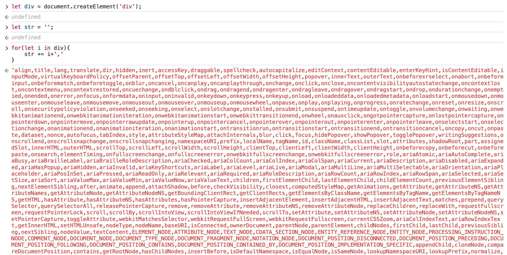

🔥Vue2虚拟节点以及createElement函数

# 1. 渲染器的渲染流程

在讨论虚拟节点之前，我们先来了解一下浏览器渲染的流程。

当浏览器接收到一个 HTML 文件后，JavaScript 引擎与浏览器的渲染引擎随即开始运行。

从渲染引擎的角度来看，它首先会把 HTML 文件解析为一个 DOM 树。

与此同时，浏览器会识别并加载 CSS 样式，然后将其与 DOM 树合并，形成一个渲染树。

在有了渲染树之后，渲染引擎会计算所有元素的位置信息，最后通过绘制操作，在屏幕上呈现出最终的内容。

JavaScript 引擎和渲染引擎虽然处于两个独立的线程之中，然而 JavaScript 引擎却能够触发渲染引擎开始工作。

当我们借助脚本去更改元素的位置或者外观时，JavaScript 引擎会运用与 DOM 相关的 API 方法来操作 DOM 对象。

此时渲染引擎便开始运作，渲染引擎会触发回流或者重绘操作。

我们来了解下回流以及重绘的概念：

* 回流：当我们对DOM的修改引发了```元素尺寸的变化```时，浏览器需要重新计算元素的大小和位置，最后将重新计算的结果绘制出来，这个过程称为回流。

* 重绘：当我们对DOM的修改只单纯```改变元素的颜色```时，浏览器此时并不需要重新计算元素的大小和位置，而只要重新绘制新样式。这个过程称为重绘。

```很显然，回流比起重绘更加消耗性能。```

通过了解浏览器基本的渲染机制，我们不难联想到，当不断地通过 JavaScript 修改 DOM 时，很容易在不经意间触发渲染引擎的回流或者重绘，而这种操作所带来的性能开销是非常巨大的。

因此，为了降低性能开销，我们需要做的是尽可能地减少对 DOM 的操作。

虚拟节点就是在这种情况下孕育而生。

# 2. 缓冲层-虚拟DOM

虚拟 DOM （Virtual DOM 以下简称 VDOM）是为了解决频繁操作 DOM 所引发的性能问题而产生的产物。

VDOM是把页面的状态抽象成 JS 对象的形式呈现。

从本质上来说，它处于 JS 与真实 DOM 之间，起着中间层的作用。

当我们需要使用 JS 脚本进行大批量的 DOM 操作时，会优先在虚拟 VDOM 这个 JS 对象上进行操作。

最后，通过对比找出将要改动的部分，并将这些改动通知并更新到真实的 DOM 上。

尽管最终仍然是对真实的 DOM 进行操作，然而虚拟 DOM 能够将多个改动合并为一个批量操作。

这样做可以减少 DOM 重排的次数，进而缩短生成渲染树以及进行绘制所花费的时间。

我们来看一下一个真实的 DOM 具体包含了哪些内容。



浏览器将真实的 DOM 设计得极为复杂。

它不但包含了自身的属性描述，如大小、位置等定义，还囊括了 DOM 所拥有的浏览器事件等内容。

正是由于其如此复杂的结构，我们频繁地去操作 DOM 或多或少会给浏览器带来性能方面的问题。

而作为数据与真实 DOM 之间的一层缓冲，虚拟 DOM 只是用于映射到真实 DOM 进行渲染，所以并不需要包含操作 DOM 的方法。它只需在对象中重点关注几个属性就可以了。

```js
// 真实DOM
<div id="app"><span>Hello World</span></div>

// 真实DOM对应的JS对象(VDOM)
{
  tag:'div',
  data:{
    id:'app'
  },
  children:[{
    tag:'span',
    children:[
      {
        tag:undefined,
        text:'Hello World'
      }
    ]
  }]
}
```

# 3. VNode 

## 3.1 Vnode构造函数

可以看出来，每一个 DOM节点 都可以使用一个 VNode 来表示。

在 Vue内部，使用 VNode 这个构造函数去描述一个节点。

```js
export default class VNode { 
  constructor(
    tag,
    data,
    children, 
    text,
    elm
  ) {
    this.tag = tag // 标签 
    this.data = data // 数据
    this.children = children // 子节点信息
    this.elm = elm // 真实DOM元素
    this.text = text // 文字（文字节点特有）
  }
}
```

由上面的代码可知。

vnode的构造参数是有序且固定的，意味着创建时不能将参数顺序传错。

我们详细阐述下下面几个核心属性。

### 3.1.1 tag

这个参数指定了要创建的虚拟节点的标签名称。

这个参数决定了最终会渲染成什么样的 DOM元素。

tag可以是 HTML 元素，比如字符串```'span'、'div'```。

```js
// 编译前
<div></div> 
// 编译后
VNode {
  tag:"div"
}
``` 

也可以是一个组件引用，同样可以是一个动态标签。 

### 3.1.2 data

data 参数通常是一个对象，包含了用于描述 VNode 的各种属性和配置信息。

data 参数可以由以下几种构成：

1. attrs

attrs 是一个对象，包含了要设置在元素上的静态属性。

如下创建一个带有 src 属性的 img 元素。

```js
// 编译前

// 编译后
VNode {
  tag:"img",
  data:{
    attrs: { src: 'image.jpg' }
  }
}
```

2. 类 (staicClass)

可以使用 class 属性来设置 CSS 类。

```js
// 编译前
<div class="custom-class"></div>
// 编译后
VNode {
  tag:"img",
  data:{ staicClass: 'custom-class' }
}
```
3. 样式 (style)

可以使用 style 属性来设置内联样式。

```js
// 编译前
<div style="color:'red'"></div>
// 编译后
VNode {
  tag:"div",
  data:{ style: { color: 'red' }}
}
```

4. 事件处理器 (on)

on 属性用于绑定事件监听器。

```js
// 编译前
<button click="() => console.log('Clicked')"></button>
// 编译后
VNode {
  tag:"button",
  data:{ on: { click: () => console.log('Clicked') } }
}
```

5. 插槽 (slot)

可以使用 slot 属性来指定一个作用域插槽或普通插槽的位置。

```js
// 编译前
<div slot="header"></div>
// 编译后
VNode {
  tag:"button",
  data:{ slot: 'header' }
}
```

6. 组件特定属性 (props)

可以使用 props 属性来传递组件的 props 数据。

```js
// 编译前
<MyComponent message="Hello World"></MyComponent>
// 编译后
VNode {
  tag:MyComponent,
  data:{ props: { message: 'Hello World' } }
}
```

7. DOM 操作指令 (directives)

可以使用 directives 来添加自定义的行为，如 v-model 或 v-show。

```js
// 编译前
<input v-model="value" />
// 编译后
VNode {
  tag:"input",
  data:{ directives: [{ name: 'model', value: 'value' }] }
}
```

8. 关键值 (key)

可以使用 key 属性来唯一标识一个 VNode，这对于列表渲染时的性能优化非常重要。

```js
// 编译前
<li key="unique-key"></li>
// 编译后
VNode {
  tag:"li",
  data:{ key: 'unique-key' }
}
``` 


### 3.1.3 children

children 参数是指定一个 VNode（虚拟节点）的子节点内容。这个参数可以包含多种类型的数据，用于描述子节点的结构和内容。

1. 文本字符串

最简单的情况是 children 参数是一个文本字符串。

这通常用于向一个元素或组件添加纯文本内容。

```js
// 编译前
<div>Hello World</div>
// 编译后
VNode {
  tag:"div", 
  data:{},
  children:[
    VNode {
      text:'Hello World'
    }
  ]
}
``` 

2. 数组

children 参数也可以是一个数组，其中包含多个子节点。

这些子节点可以是任意组合的 VNode 对象、字符串或其他可以转换为 VNode 的数据结构。

### 3.1.4 text

我们知道并不是每个节点都有tag的，比如文字节点就没有tag。

在vue中，文字也代表一个vnode。

```js
// 编译前
"我是" 
// 编译后
VNode {
  text:"我是"
}
```

### 3.1.5 elm

每一个虚拟节点都对应着一个真实DOM节点。

所以这个elm就是对应虚拟节点上绑定真实DOM节点。
 

> Vnode 定义的属性大约有二十几个。
>
> 显然，使用 Vnode 对象要比真实 DOM 对象所描述的内容简单得多。
>
> 它只单纯用来描述节点的关键属性，例如标签名、数据、子节点等。
>
> 并没有保留与浏览器相关的 DOM 方法。
>
> 除此之外，Vnode 还会有其他的属性，用以扩展 Vue 的灵活性。

## 3.2 createEmptyVNode

在虚拟DOM中，注释也被当成是一个节点。

```js
// 创建注释vnode节点
const createEmptyVNode = (text: string = '') => {
  const node = new VNode()
  node.text = text
  node.isComment = true
  return node
};
```

## 3.3 createEmptyVNode

```js
// 创建文本vnode节点
export function createTextVNode(val: string | number) {
  return new VNode(undefined, undefined, undefined, String(val))
}
```

## 3.4 cloneVNode

注意这里对 children使用了 slice。

表示这里只是做了一层浅拷贝

```js
export function cloneVNode(vnode: VNode): VNode {
  const cloned = new VNode(
    vnode.tag,
    vnode.data,
    vnode.children && vnode.children.slice(),
    vnode.text,
    vnode.elm,
    vnode.context,
    vnode.componentOptions,
    vnode.asyncFactory
  )
  cloned.ns = vnode.ns
  cloned.isStatic = vnode.isStatic
  cloned.key = vnode.key
  cloned.isComment = vnode.isComment
  cloned.fnContext = vnode.fnContext
  cloned.fnOptions = vnode.fnOptions
  cloned.fnScopeId = vnode.fnScopeId
  cloned.asyncMeta = vnode.asyncMeta
  cloned.isCloned = true
  return cloned
}
```

## 3.5 emptyNodeAt

传入一个真实 DOM，获取基于这个真实 DOM元素所产生的虚拟 DOM。

```js
function emptyNodeAt(elm) {
  return new VNode(nodeOps.tagName(elm).toLowerCase(), {}, [], undefined, elm)
}
```

# 4. createElement函数

经过上面的学习，我们知道虚拟 DOM就是一个JS对象。

只不过他有很多属性，所以创建一个虚拟 DOM也绝不是什么难事。

但是 vue 框架给我们提供了一个函数createElement。 

## 4.1 createElement函数的优势

createElement函数的意义在于它提供了一种更方便、更简洁且更具可读性的方式来创建vnode，相比直接编写 VNode 具有以下好处： 

### 4.1.1 直观的参数形式

使用createElement函数可以通过直观的参数来描述虚拟节点的属性。

相比之下，直接编写 VNode 对象时，需要手动构建一个包含多个属性的 JavaScript 对象，可能会导致代码较为冗长和复杂，降低了可读性和可维护性。

### 4.1.2 统一的创建方式

在项目中使用createElement函数可以确保虚拟节点的创建方式一致。

直接编写 VNode 对象可能会导致不同的开发者采用不同的方式来构建虚拟节点，从而降低了代码的一致性和可维护性。

### 4.1.3 动态属性和条件判断

createElement函数可以接收动态的参数，允许在运行时根据条件来决定虚拟节点的属性。例如，可以根据数据的变化动态地添加或修改属性，或者根据条件判断来决定是否创建某个子节点。

直接编写 VNode 对象时，要实现类似的动态行为可能需要更多的代码和逻辑处理，增加了代码的复杂性。

## 4.2 源码解读

```js
export function _createElement(
  context: Component,
  tag?: string | Component | Function | Object,
  data?: VNodeData,
  children?: any,
  normalizationType?: number
): VNode | Array<VNode> {
  if (isDef(data) && isDef((data as any).__ob__)) {
    __DEV__ &&
      warn(
        `Avoid using observed data object as vnode data: ${JSON.stringify(
          data
        )}\n` + 'Always create fresh vnode data objects in each render!',
        context
      )
    return createEmptyVNode()
  }
  // object syntax in v-bind
  if (isDef(data) && isDef(data.is)) {
    tag = data.is
  }
  if (!tag) {
    // in case of component :is set to falsy value
    return createEmptyVNode()
  }
  // warn against non-primitive key
  if (__DEV__ && isDef(data) && isDef(data.key) && !isPrimitive(data.key)) {
    warn(
      'Avoid using non-primitive value as key, ' +
        'use string/number value instead.',
      context
    )
  }
  // support single function children as default scoped slot
  if (isArray(children) && isFunction(children[0])) {
    data = data || {}
    data.scopedSlots = { default: children[0] }
    children.length = 0
  }
  if (normalizationType === ALWAYS_NORMALIZE) {
    children = normalizeChildren(children)
  } else if (normalizationType === SIMPLE_NORMALIZE) {
    children = simpleNormalizeChildren(children)
  }
  let vnode, ns
  if (typeof tag === 'string') {
    let Ctor
    ns = (context.$vnode && context.$vnode.ns) || config.getTagNamespace(tag)
    if (config.isReservedTag(tag)) {
      // platform built-in elements
      if (
        __DEV__ &&
        isDef(data) &&
        isDef(data.nativeOn) &&
        data.tag !== 'component'
      ) {
        warn(
          `The .native modifier for v-on is only valid on components but it was used on <${tag}>.`,
          context
        )
      }
      vnode = new VNode(
        config.parsePlatformTagName(tag),
        data,
        children,
        undefined,
        undefined,
        context
      )
    } else if (
      (!data || !data.pre) &&
      isDef((Ctor = resolveAsset(context.$options, 'components', tag)))
    ) {
      // component
      vnode = createComponent(Ctor, data, context, children, tag)
    } else {
      // unknown or unlisted namespaced elements
      // check at runtime because it may get assigned a namespace when its
      // parent normalizes children
      vnode = new VNode(tag, data, children, undefined, undefined, context)
    }
  } else {
    // direct component options / constructor
    vnode = createComponent(tag as any, data, context, children)
  }
  if (isArray(vnode)) {
    return vnode
  } else if (isDef(vnode)) {
    if (isDef(ns)) applyNS(vnode, ns)
    if (isDef(data)) registerDeepBindings(data)
    return vnode
  } else {
    return createEmptyVNode()
  }
}
```

### 4.2.1 避免将响应式对象传入data中

```js
if (isDef(data) && isDef((data as any).__ob__)) {
  __DEV__ &&
    warn(
        `Avoid using observed data object as vnode data: ${JSON.stringify(
          data
        )}\n` + 'Always create fresh vnode data objects in each render!',
        context
  )
  return createEmptyVNode()
}
```
 
上面这个是_createElement的第一个 if 语句。

检查传入的data参数是否定义了，并且这个data对象是否有__ob__属性。

__ob__属性通常由Vue的响应式系统添加到一个对象上，表示这个对象已经被Observer系统观察，也就是说它是一个响应式的对象。

比如在vue组件定义的data属性中的每一项都是响应式对象。

如果在data属性中传入一个响应式对象，会出现一个警告信息提示你。

这是因为在vue中，直接修改已有的响应式对象来创建vnode，可能会导致不必要的重渲染或者其他难以追踪的错误。

如果你传入了一个响应式对象，函数会返回一个空的vnode。

### 4.2.2 data.is实现动态切换tag

```js
if (isDef(data) && isDef(data.is)) {
  tag = data.is
}
```

这是第二个if判断。

data.is 是一个特殊的属性，用于指定组件的真实标签名。

当在模板中使用组件时，有时需要动态地更改组件渲染的标签名，这时就可以使用 is 属性。 

```js
<template>
  <div>
    <!-- 动态组件 -->
    <component :is="dynamicComponent" />
  </div>
</template>

<script>
export default {
  data() {
    return {
      dynamicComponent: 'div' // 默认渲染为 div
    };
  },
};
</script>
```
> 但是经过研究发现在模版中传入is并不会传入data当中，而是直接在编译时变成了第一个参数进行传递。

### 4.2.3 tag非空判断

```js
if (!tag) {
  // in case of component :is set to falsy value
  return createEmptyVNode()
}
```
正如注释所说，为了防止is传入空值。

比如下面这些情况，会返回一个空的vnode。

```bash
// 编译前
<component :is="0">
<div :is="false"></div>
<span :is="undefined">
// 编译后
_createElement(0,{tag:'component'})
_createElement(false,{tag:'div'})
_createElement(undefined,{tag:'span'})
```
> 可以通过```data.tag```来判断标签。

### 4.2.4 判断 data.key 是否是原始类型

```js
if (__DEV__ && isDef(data) && isDef(data.key) && !isPrimitive(data.key)) {
    warn(
      'Avoid using non-primitive value as key, ' +
        'use string/number value instead.',
      context
    )
}
```

这段逻辑判断了如果data.key不是一个原始类型（字符串/数字），则会发出警告。

因为如果存在一个非原始类型的key，可能会导致一些不可预测的行为以及性能问题等。

### 4.2.5 处理作用域插槽

```js
if (isArray(children) && isFunction(children[0])) {
  data = data || {}
  data.scopedSlots = { default: children[0] }
  children.length = 0
}
```

作用域插槽可以很容易的使父组件使用子组件的数据。 

```js
// 父组件
<child-component>
  <template v-slot:default="{ items }">
    <ul>
      <li v-for="item in items" :key="item">{{ item }}</li>
    </ul>
  </template>
</child-component>

// 子组件（child-component）
<template>
  <slot :items="['1','2','3']"/>
</template>
```
在这个例子中，```<template>```标签定义了一个作用域插槽，其中的函数体将访问子组件传递的items属性。

在Vue的内部实现中，当解析模板时，如果遇到一个包含作用域插槽的```<template>```标签，它会被转换为一个函数。

这是因为作用域插槽需要根据子组件的数据动态地生成内容。这个函数会在渲染时被调用，并返回一个或多个VNode。

因此，在_createElement函数中，如果children数组的第一个元素是一个函数，这就表明这是一个作用域插槽的内容。

此时，Vue会将这个函数转换为scopedSlots属性的一部分，并清空children数组，以确保在后续的渲染过程中不会重复处理这个函数。

### 4.2.6 根据normalizationType来规范化节点

```js
if (normalizationType === ALWAYS_NORMALIZE) {
  children = normalizeChildren(children)
} else if (normalizationType === SIMPLE_NORMALIZE) {
  children = simpleNormalizeChildren(children)
}
```

#### 4.2.6.1 规范化类型

normalizationType变量指定了应该如何规范化children。根据normalizationType的不同值，Vue会采用不同的规范化策略：

1. ```ALWAYS_NORMALIZE```：总是执行完整的规范化处理。
2. ```SIMPLE_NORMALIZE```：执行简单的规范化处理。

#### 4.2.6.2 规范化函数

1. normalizeChildren(children)

当normalizationType为ALWAYS_NORMALIZE时，会调用normalizeChildren函数。这个函数负责将children转换为一个标准化的VNode数组，无论它们最初是以何种形式传递的。

```js
export function normalizeChildren(children: any): Array<VNode> | undefined {
  return isPrimitive(children)
    ? [createTextVNode(children)]
    : isArray(children)
    ? normalizeArrayChildren(children)
    : undefined
}
```

*  如果children是一个原始类型（如字符串或数字），则将其转换为一个包含单个文本VNode的数组。这样做的目的是将原始类型的值转换为一个可渲染的VNode。

* 如果children是一个数组，那么调用normalizeArrayChildren函数来进一步处理数组中的元素。这一步主要是为了处理数组中的各种可能的子元素类型，并将它们转换为统一的VNode数组。

* 如果children既不是原始类型也不是数组，则返回undefined。这种情况通常意味着children是一个对象或null，在这种情况下，不进行任何处理，返回undefined。

2. simpleNormalizeChildren(children)

当normalizationType为SIMPLE_NORMALIZE时，会调用simplifyNormalizeChildren函数。这个函数执行较为简单的规范化处理，通常用于不需要完整规范化的场景。

```js
export function simpleNormalizeChildren(children: any) {
  for (let i = 0; i < children.length; i++) {
    if (isArray(children[i])) {
      return Array.prototype.concat.apply([], children)
    }
  }
  return children
}
```

这段代码的主要目的是处理嵌套数组，确保最终返回的children是一个一维的数组。

这对于Vue.js在渲染过程中处理子元素非常重要，因为它确保了渲染逻辑的一致性和可预测性。通过这种方式，Vue能够更好地管理和渲染各种类型的子元素。

> vm._c 中默认使用的是第二种模式simpleNormalizeChildren，因为编译的时候已经规范化了，无需对children再进一步处理。

### 4.2.7 创建vnode

```js
let vnode, ns
if (typeof tag === 'string') {
    let Ctor
    ns = (context.$vnode && context.$vnode.ns) || config.getTagNamespace(tag)
    if (config.isReservedTag(tag)) {
      // platform built-in elements
      if (
        __DEV__ &&
        isDef(data) &&
        isDef(data.nativeOn) &&
        data.tag !== 'component'
      ) {
        warn(
          `The .native modifier for v-on is only valid on components but it was used on <${tag}>.`,
          context
        )
      }
      vnode = new VNode(
        config.parsePlatformTagName(tag),
        data,
        children,
        undefined,
        undefined,
        context
      )
    } else if (
      (!data || !data.pre) &&
      isDef((Ctor = resolveAsset(context.$options, 'components', tag)))
    ) {
      // component
      vnode = createComponent(Ctor, data, context, children, tag)
    } else {
      // unknown or unlisted namespaced elements
      // check at runtime because it may get assigned a namespace when its
      // parent normalizes children
      vnode = new VNode(tag, data, children, undefined, undefined, context)
    }
} else {
    // direct component options / constructor
    vnode = createComponent(tag as any, data, context, children)
}
```

上面就是根据tag、data、children等属性来创建一个vnode。

### 4.2.8 返回vnode

```js
 if (isArray(vnode)) {
    return vnode
  } else if (isDef(vnode)) {
    if (isDef(ns)) applyNS(vnode, ns)
    if (isDef(data)) registerDeepBindings(data)
    return vnode
  } else {
    return createEmptyVNode()
  }
```

在一系列的处理过后，最终返回需要的vnode。

# 5. Component类型的vnode

在vue的模版编译中，会根据html标签进行编译。

不会根据你的标签类型来区分编译的结果。

比如：

```js
<div>Hello World</div>
<ChildComponent>
```

上面的2个标签会被编译成：

```js
_c('div',["Hello World"])
_c('ChildComponent')
```

他没有根据你的标签来决定编译的结果不同。

所以我们在_createElement就要加上对应的逻辑。

用于区分并生成不同的VNode。

因为_c的参数tag均为字符串。

所以根据isReservedTag来判断是否是保留字。

如果非保留字且实例上的components存在对应的键值对时，则表示这是一个组件。

调用createComponent并将对应的组件当作第一个参数传入。

```js
export function createComponent(
  Ctor,
  data,
  context,
  children,
  tag
){ 

  const baseCtor = context.$options._base

  // plain options object: turn it into a constructor
  if (isObject(Ctor)) {
    Ctor = baseCtor.extend(Ctor as typeof Component)
  }

  // if at this stage it's not a constructor or an async component factory,
  // reject.
  if (typeof Ctor !== 'function') {
    if (__DEV__) {
      warn(`Invalid Component definition: ${String(Ctor)}`, context)
    }
    return
  }

  // async component
  let asyncFactory
  // @ts-expect-error
  if (isUndef(Ctor.cid)) {
    asyncFactory = Ctor
    Ctor = resolveAsyncComponent(asyncFactory, baseCtor)
    if (Ctor === undefined) {
      // return a placeholder node for async component, which is rendered
      // as a comment node but preserves all the raw information for the node.
      // the information will be used for async server-rendering and hydration.
      return createAsyncPlaceholder(asyncFactory, data, context, children, tag)
    }
  }

  data = data || {}

  // resolve constructor options in case global mixins are applied after
  // component constructor creation
  resolveConstructorOptions(Ctor as typeof Component)

  // transform component v-model data into props & events
  if (isDef(data.model)) {
    // @ts-expect-error
    transformModel(Ctor.options, data)
  }

  // extract props
  // @ts-expect-error
  const propsData = extractPropsFromVNodeData(data, Ctor, tag)

  // functional component
  // @ts-expect-error
  if (isTrue(Ctor.options.functional)) {
    return createFunctionalComponent(
      Ctor as typeof Component,
      propsData,
      data,
      context,
      children
    )
  }

  // extract listeners, since these needs to be treated as
  // child component listeners instead of DOM listeners
  const listeners = data.on
  // replace with listeners with .native modifier
  // so it gets processed during parent component patch.
  data.on = data.nativeOn

  // @ts-expect-error
  if (isTrue(Ctor.options.abstract)) {
    // abstract components do not keep anything
    // other than props & listeners & slot

    // work around flow
    const slot = data.slot
    data = {}
    if (slot) {
      data.slot = slot
    }
  }

  // install component management hooks onto the placeholder node
  installComponentHooks(data)

  // return a placeholder vnode
  // @ts-expect-error
  const name = getComponentName(Ctor.options) || tag
  const vnode = new VNode(
    // @ts-expect-error
    `vue-component-${Ctor.cid}${name ? `-${name}` : ''}`,
    data,
    undefined,
    undefined,
    undefined,
    context,
    // @ts-expect-error
    { Ctor, propsData, listeners, tag, children },
    asyncFactory
  )

  return vnode
}
```

## 7.1 installComponentHooks

```js
const componentVNodeHooks = {
  init(vnode: VNodeWithData, hydrating: boolean): boolean | void {
    if (
      vnode.componentInstance &&
      !vnode.componentInstance._isDestroyed &&
      vnode.data.keepAlive
    ) {
      // kept-alive components, treat as a patch
      const mountedNode: any = vnode // work around flow
      componentVNodeHooks.prepatch(mountedNode, mountedNode)
    } else {
      const child = (vnode.componentInstance = createComponentInstanceForVnode(
        vnode,
        activeInstance
      ))
      child.$mount(hydrating ? vnode.elm : undefined, hydrating)
    }
  },

  prepatch(oldVnode: MountedComponentVNode, vnode: MountedComponentVNode) {
    const options = vnode.componentOptions
    const child = (vnode.componentInstance = oldVnode.componentInstance)
    updateChildComponent(
      child,
      options.propsData, // updated props
      options.listeners, // updated listeners
      vnode, // new parent vnode
      options.children // new children
    )
  },

  insert(vnode: MountedComponentVNode) {
    const { context, componentInstance } = vnode
    if (!componentInstance._isMounted) {
      componentInstance._isMounted = true
      callHook(componentInstance, 'mounted')
    }
    if (vnode.data.keepAlive) {
      if (context._isMounted) {
        // vue-router#1212
        // During updates, a kept-alive component's child components may
        // change, so directly walking the tree here may call activated hooks
        // on incorrect children. Instead we push them into a queue which will
        // be processed after the whole patch process ended.
        queueActivatedComponent(componentInstance)
      } else {
        activateChildComponent(componentInstance, true /* direct */)
      }
    }
  },

  destroy(vnode: MountedComponentVNode) {
    const { componentInstance } = vnode
    if (!componentInstance._isDestroyed) {
      if (!vnode.data.keepAlive) {
        componentInstance.$destroy()
      } else {
        deactivateChildComponent(componentInstance, true /* direct */)
      }
    }
  }
}

function installComponentHooks(data: VNodeData) {
  const hooks = data.hook || (data.hook = {})
  for (let i = 0; i < hooksToMerge.length; i++) {
    const key = hooksToMerge[i]
    const existing = hooks[key]
    const toMerge = componentVNodeHooks[key]
    // @ts-expect-error
    if (existing !== toMerge && !(existing && existing._merged)) {
      hooks[key] = existing ? mergeHook(toMerge, existing) : toMerge
    }
  }
}
```

所以当这个VNode是一个组件VNode时。

他的data.hooks是有值并存在四个hook的。

# 6. 总结 

为了避免重复操作真实 DOM 所带来的性能消耗，vue框架引入了虚拟 DOM。

虚拟 DOM本质上就是一个具有特有属性的一个 JS对象。

为了实现创建虚拟 DOM 的一致性，vue提供了一个方法 createElement 用来方便快捷的生成虚拟 DOM。


